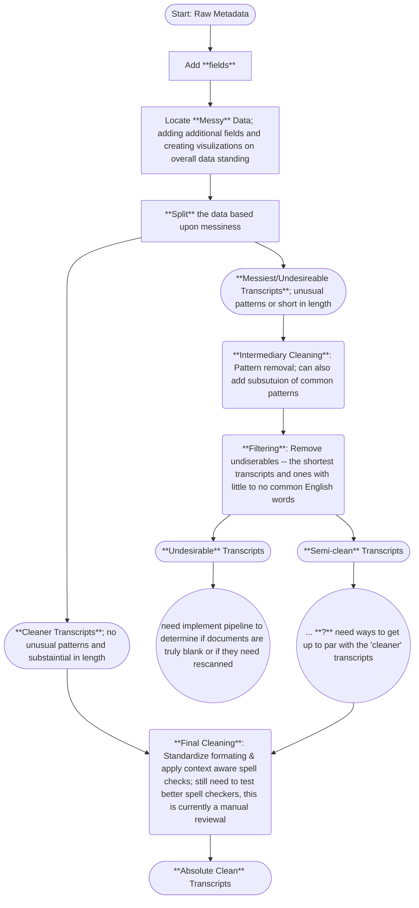

# Data handling of USC digital collections metadata

## Notebooks setup 
### Setup venv & notebook kernel
#### Create a virtual environment
In the command line for our project directory, (../AspireAI_LLM_Project/), create a python virtual enviroment (purpose of a vir env is to isolate project libs/packages all into one place)
```bash 
python -m venv venv
```
#### Activate venv and install required libaries
```bash 
venv/scripts/activate
pip install -r requirements.txt
```
#### Make venv useable as notebooks kernel (via ipykernel)
'ipykernel' was installed as one of the packages in the venv, now we can use that to allow our packages to be useable in notebooks (as a kernel)
```bash
python -m ipykernel install --user --name=venv_aspire --display-name "Python (venv_aspire)"
```
Then exit and relaunch VS Code (or other notebook supporting IDE)
#### Notebooks are setup
* Choose 'Python (venv_aspire)' as the kernel when using any notebook for this project 
* Add new libaries to the requirements.txt
* Activate the venv and install the requirements.txt anytime crirtical libraries are added to the project 

### Notebook workflow
###### *Note:* Rounded rectanges = excel file, regular rectangles = notebook, circle = missing step in proccess 


## util folder
### Importing modules
