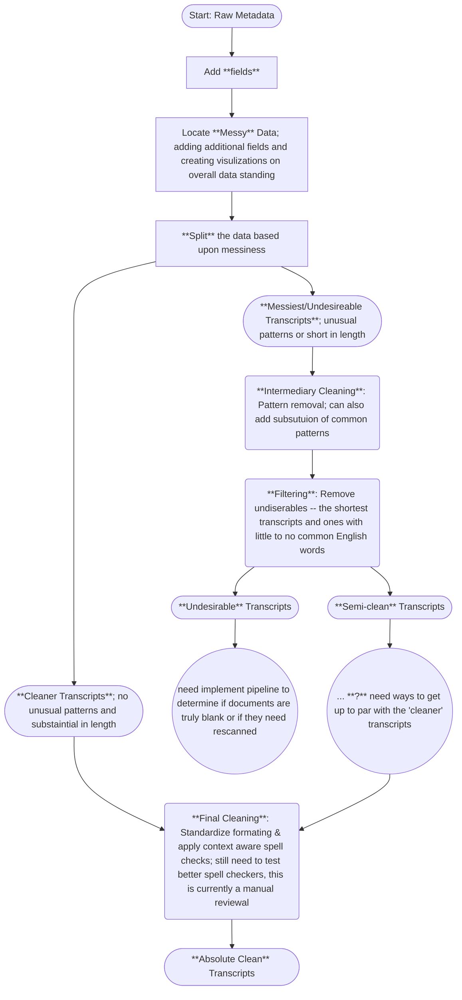

# Data handling of USC digital collections metadata

## Notebook use-cases
### Primary data notebooks
**01-contentdm-data-proccessing.ipynb**
- This is the primary notebook, with contentdm data being used thoughout the entire project.
- This notebook is the end-to-end pipeline for contentdm data. It filters the data into the /data/ folders in a given data set. 
- If you want to use this notebook on a new data set, just ensure the first 3 characters of the dataset name are unique (e.g. mcc is pulled for mccray, so if a new dataset was called mccnelly, then maybe adjust it to be amccnelly.)
- The instructions at the top of this notebook give more detail on how to adjust the config. 

**01-seeklight-data-proccessing.ipynb**
- This is the notebook that was created for seeklight metadata. This is a work-in-progress
- Purpose of this notebook is to map the .txt files to a csv file.

**01-seeklight-data-proccessing.ipynb**
- This is the notebook that was created for seeklight metadata. This is a work-in-progress
- Purpose of this notebook is to do the minimal filtering steps required for seeklight metadata.

### Secondary notebooks / scripts
**nltk_corpus.ipynb**
- This is a notebook that formed a corpus of field specific data, using mccray alongside scraped civil rights era data. This corpus is used for the contentdm valid word checking in `01-contentdm-data-proccessing.ipynb`. It forms of a field specific nltk word corpus.
- This notebook's output is `/data/mccray/combined_words_corpus.txt` and `/data/mccray/mccray_only_words_corpus.txt`. This is an extensive word corpus, that can be used for future projects, or the notebook can be built upon if the dataset should cover a wider range of history. It was used for all contentdm datasets in this project, not just the mccray dataset.

**seeklight_helpers/** (folder of scripts)
- These are the scripts that were used to help handle png files for transcriptions. If doing any seeklight transcribing, these scripts can be useful. See the README in this directory for more details.


## Notebooks setup instructions 
> [!NOTE]
> This information is for those that are unfamiliar with using notebook files, if you understand how this works, then you can disregard. Just make a Python venv, install the requirements, and use it for your Juypter notebook kernel.
### Setup venv & notebook kernel
#### Create a virtual environment
In the command line for our project directory, (../AspireAI_LLM_Project/), create a python virtual enviroment (purpose of a vir env is to isolate project libs/packages all into one place)
```bash 
python -m venv venv
```
#### Activate venv and install required libaries
```bash 
venv/scripts/activate
pip install -r requirements.txt
```
#### Make venv useable as notebooks kernel (via ipykernel)
'ipykernel' was installed as one of the packages in the venv, now we can use that to allow our packages to be useable in notebooks (as a kernel)
```bash
python -m ipykernel install --user --name=venv_aspire --display-name "Python (venv_aspire)"
```
Then exit and relaunch VS Code (or other notebook supporting IDE)
#### Notebooks are setup
* Choose 'Python (venv_aspire)' as the kernel when using any notebook for this project 
* Add new libaries to the requirements.txt
* Activate the venv and install the requirements.txt anytime crirtical libraries are added to the project 

### Notebook workflow for seeklight
###### *Note:* Rounded rectanges = excel file, regular rectangles = notebook, circle = missing step in proccess 

```mermaid
flowchart TD
    A([Start: Raw Metadata]) --> B[Add **fields**]

    B --> C[Locate **Messy** Data; adding additional fields and creating visulizations on overall data standing]
    C --> D[**Split** the data based upon messiness]

    D --> Y([**Cleaner Transcripts**; no unusual patterns and substaintial in length])

    Y --> G(**Final Cleaning**: Standardize formating & apply context aware spell checks; still need to test better spell checkers, this is currently a manual reviewal)

    D --> F([**Messiest/Undesireable Transcripts**; unusual patterns or short in length])
    F --> H(**Intermediary Cleaning**: Pattern removal; can also add subsutuion of common patterns)
    H --> L(**Filtering**: Remove undiserables -- the shortest transcripts and ones with little to no common English words)
    L --> M([**Undesirable** Transcripts])
    M --> O((need implement pipeline to determine if documents are truly blank or if they need rescanned))


    L --> I([**Semi-clean** Transcripts])
    I --> J((... **?** need ways to get up to par with the 'cleaner' transcripts))
    J --> G

    G --> K([**Absolute Clean** Transcripts])

```

